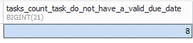

# mySQL_tasks-db
```
-- 1 Find out how many tasks are in the task table
SELECT
  COUNT(*) AS tasks_count
FROM task;
```


```
-- 2 Find out how many tasks in the task table do not have a valid due date
SELECT
  COUNT(task.id) AS tasks_count_task_do_not_have_a_valid_due_date
FROM task
WHERE task.due_date IS NULL;
```


```
-- 3 Find all the tasks that are marked as done
SELECT
  task.title AS task_title,
  status.name AS task_status
FROM task
  INNER JOIN status
    ON task.status_id = status.id
WHERE status.name = 'done';
```


```
-- 4 Find all the tasks that are not marked as done
SELECT
  task.title AS task_title,
  status.name AS task_status
FROM task
  INNER JOIN status
    ON task.status_id = status.id
WHERE status.name != 'done';
```


```
-- 5 Get all the tasks, sorted with the most recently created first
SELECT
  task.created,
  task.title
FROM task
ORDER BY task.created DESC;
```


```
-- 6 Get the single most recently created task
SELECT
  task.title as most_recently_created_task,
   task.created
FROM task
ORDER BY task.created DESC
  limit 1;
  ```
  
  
  
```
-- 7 Get the title and due date of all tasks where the title or description contains database
SELECT
  task.title task_title,
  task.due_date
FROM task
WHERE task.title LIKE '%database%'
OR task.description LIKE '%database%'
```


```
-- 8 Get the title and status (as text) of all tasks
SELECT CONCAT( "title: ", task.title,". status: ",  status.name) tasks_and_status
FROM task
  INNER JOIN status
    ON task.status_id = status.id
```
  

```
-- 9 Get the name of each status, along with a count of how many tasks have that status
SELECT
  status.name AS status_name,
  COUNT(task.id) AS tasks_count
FROM task
  INNER JOIN status
    ON task.status_id = status.id
GROUP BY status.name
```


```
-- 10 Get the names of all statuses, sorted by the status with most tasks first
SELECT
  status.name AS status_name,
  COUNT(task.id) AS tasks_count
FROM task
  INNER JOIN status
    ON task.status_id = status.id
GROUP BY status.name
ORDER BY tasks_count DESC
```


